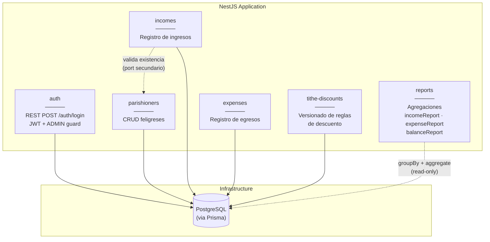
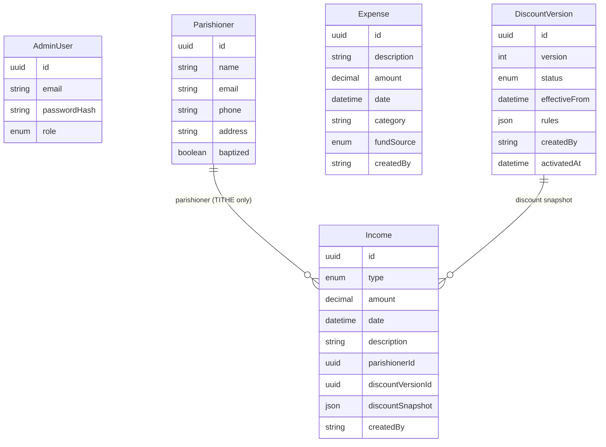
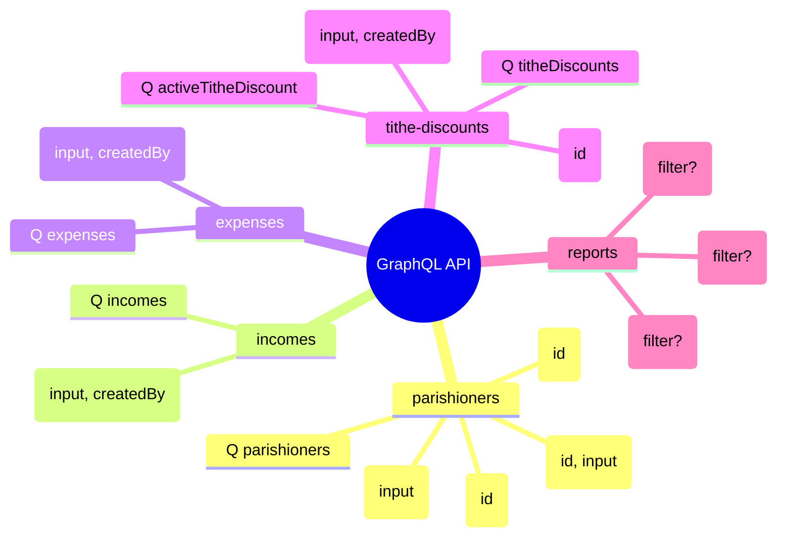
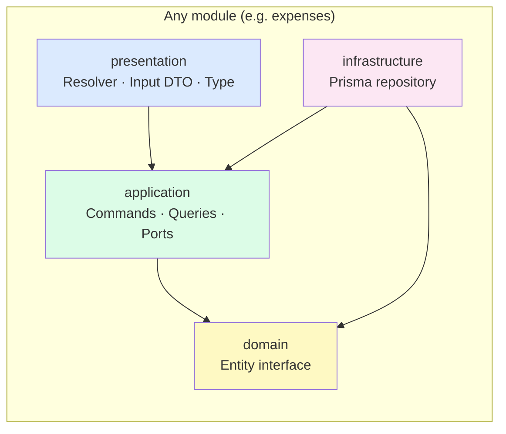
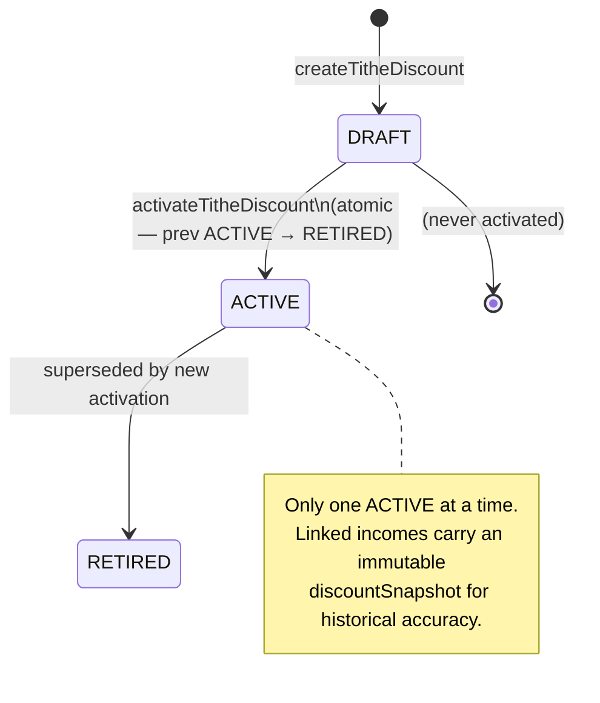

# Architecture — ipul-be

> Last updated: 2026-06-13 · PR3 complete (all 4 slices merged)

Living document. Updated at the end of each slice.

---

## Module map

---

## Data model (ERD)

---

## GraphQL API surface

> All GraphQL operations require `Authorization: Bearer <JWT>` with `ADMIN` role.
> Auth is a separate REST endpoint: `POST /auth/login`.

---

## Clean architecture layers (per module)

**Dependency rule**: arrows point inward only. Infrastructure implements the port defined by application — never the other way around.

---

## DiscountVersion lifecycle

---

## Slice progress

| Slice | Module | Status |
|-------|--------|--------|
| PR1 | auth, bootstrap, Prisma | ✅ merged |
| PR2 | parishioners, incomes | ✅ merged |
| PR3 — Slice 1 | expenses | ✅ merged |
| PR3 — Slice 2 | tithe-discounts | ✅ PR open (#4) |
| PR3 — Slice 3 | reports | ✅ PR open |
| PR3 — Slice 4 | hardening (e2e, docs) | ✅ PR open (#6) |
